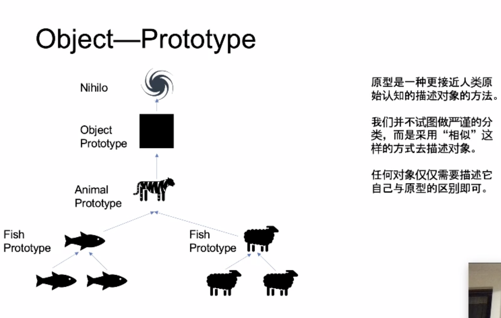
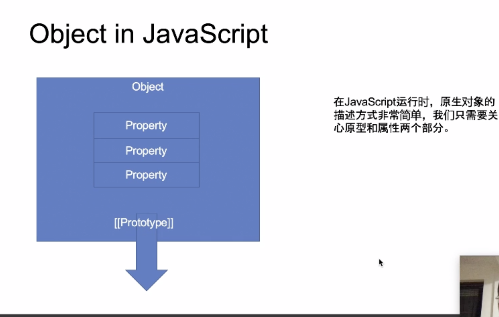
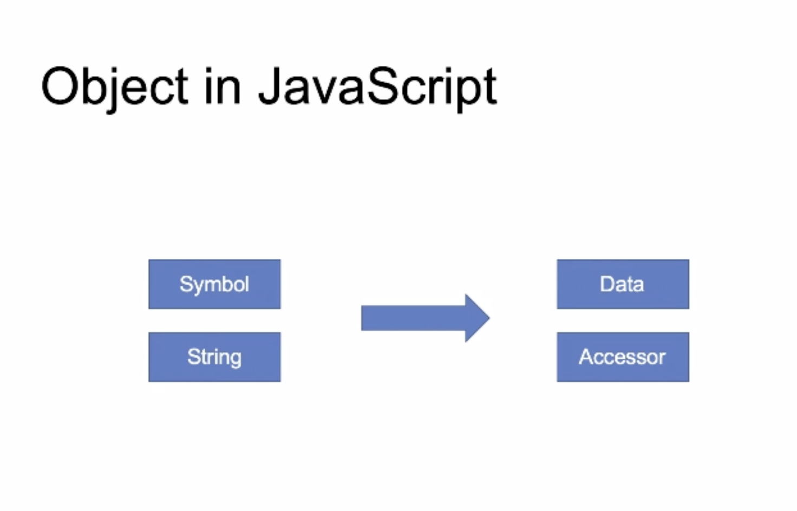
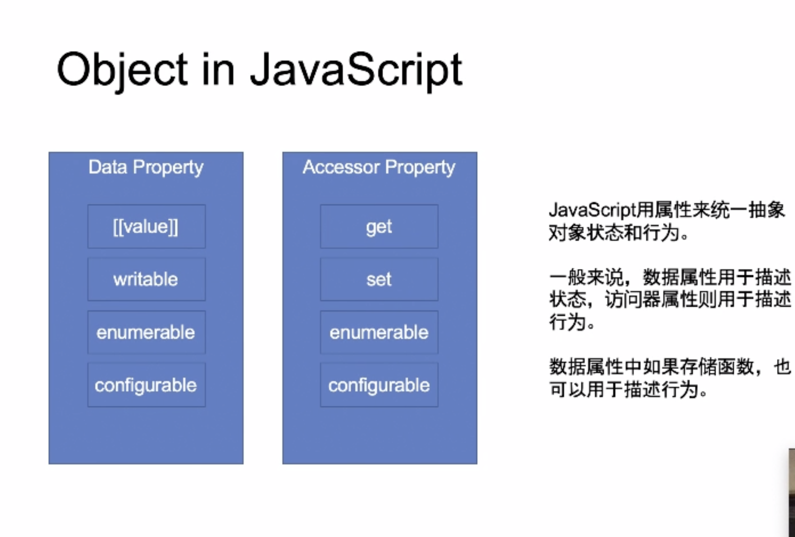

# Week04-表达式、类型转换、语句、对象

## 表达式

* Left Handside (赋值操作的目标) Reference 引用

  * 运算符

  * 表达式树结构 => 表达式优先级

    - Member

      ```
      a.b
      a[b]
      foo`string` // styles-compontents
      super.b
      super[b]
      new.target // 判断函数是否是new调用
      new Foo()
      ```

    - New

      `new Foo`

    - Call

      ```
      foo()
      super()
      foo()[b]
      foo().b
      foo()`string`
      ```

* Right Handside (赋值操作的来源)

  * Update

    ```javascript
    a++
    a--
    --a
    ++a
    ```

  * Unary

    ```javascript
    delete a.b
    void 0; // 生成undefined
    typeof a
    +a
    -a
    ~a
    !a // !!a 转换为boolean值
    await a
    ```

  * Exponental

    `**`

  * Multiplicative

    `\* / %`

  * Additive

  * Shift

    << >> >>>

  * Relationship

    < > <= >= instanceof in

  * Equality

    ```
    ==
    !=
    ===
    !==
    ```

  * Bitwise 位运算

    & ^ |

  * Logical

    ```
    && ||
    短路逻辑
    ```

  * Conditional

    ? :

    

有效数字判断

```javascript
function sign(number) {
	if(1/number === Infinity) {
    return 1;
  }
  if(1/number === -Infinity) {
    return -1;
  }
  return number / Math.abs(number);
}
```

* 浮点数尽量不要做算数运算，考虑精度丢失的影响。


## 类型准换

#### 基础类型

Undefined、Boolean、String、Number、Null、Symbol、BigInt、Object

#### 装箱拆箱

* 装箱：基础类型 => 包装类型 `Boolean String Boolean ...`

* 拆箱：包装类型(Object) => 基础类型, 会优先调用`valueOf toString toPrimitive`进行转换

#### 类型的判断

- typeof
- Obejct.prototype.toString.call
- instanceof

#### 隐式转换发生的场景

- Left Handside Right Handside

  左右取值，转换为原始值，如果转换后的值存在string, 则进行toString后拼接。否则按toNumber处理

- ==

  优先按照number处理

- if

  优先按照boolean处理

- 数学运算符

  优先转换非number为number

## 语句（Statement）

### Completion Record

[[type]]: normal, break, continue, return, or throw

[[value]]: Types（7种类型）

[[target]]: label

#### 简单语句

* ExpressionStatement

  `a = 1 + 2;`

* EmptyStatement

  `；`

* DebuggerStatement

  给调试使用，产生调试中断

  `debugger`

* ThrowStatement

  `throw a;`

* ContinueStatement

  `continue label;`

* BreakStatement

  `break label2;`

* ReturnStatement

  `return;`

### 复合语句

* BlockStatement

  block 内是 normal 语句，如果有非 normal 语句会中断

  * [[type]]: normal
  * 待补充

  ```
  // 不合法
  {
  	a:1
  }
  
  ```

* Iteration

  * while
  * do while
  * for(;;)
  * for(in)
  * for(of)

## 对象 Object

标准解释

* state
* behavior
* identifier

其它解释

* 封装、复用、解偶

* 继承

* 多态









Function

http://www.github.com/wintercn/JSinJS/blob/master/source/LexicalParser.js


-----

## 作业

#### JavaScript 中特殊行为的对象

- Function Object

  - [[call]] 视为函数Function
  - [[Construct]] 可以被new 操作符调用，根据new的规则返回对象。

- Array Object

  - [[DefineOwnProperty]]

    - Property == length

      设置对象的length属性，根据length的变化对对象进行操作

      newLength > length 用空扩充数组

      newLength < length 截取数组

- String Object

  string的length是不可写不可配的。

- Arguments Object

  [[callee]] 视为函数参数对对象，伪数组 caller

- Object

  [[Get]] property被访问时调用 get

  [[Set]] property被赋值时调用 set

  [[GetPrototypeOf]] 对应getPrototypeOf方法 获取对象原型

  [[SetPrototypeOf]] 对应setPrototypeOf方法 设置对象原型

  [[GetOwnProperty]] getOwnPropertyDescriptor 获取对象私有属性的描述列表

  [[HasProperty]] hasOwnProperty 私有属性判断

  [[IsExtensible]] isExtensible对象是否可扩展

  [[PreventExtensions]] preventExtension控制对象是否可以添加属性

  [[DefineOwnProperty]] defineProperty 定义对象属性

  [[Delete]] delete 操作符

  [[OwnPropertyKeys]] Object.keys() Object.entries() Object.values()

  [[Call]] 能够调用call

- Module Namespece

  [[Module]] 视为一个引入的模块

  [[Exports]] 视为一个导出的模块